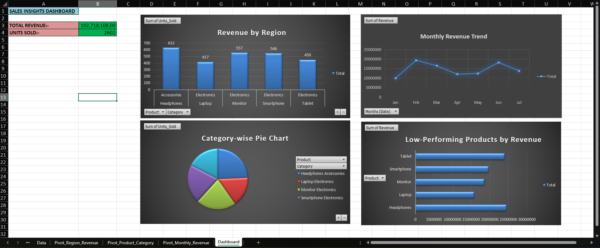
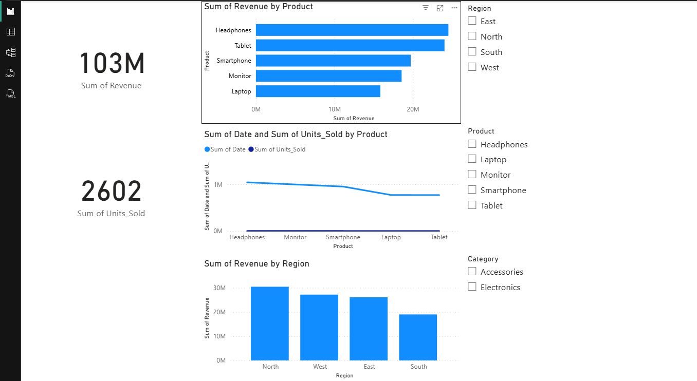

# 📊 Sales Insights Dashboard (Excel + Power BI)

This project analyzes simulated e-commerce sales data using Excel and Power BI. It focuses on identifying sales performance by region, product, and category — with KPI cards, trends, and actionable product insights.

---

## 🚀 Tools Used
- Microsoft Excel
- Power BI Desktop
- Pivot Tables, Slicers, Charts, DAX

---

## 📈 Key Features
- 💰 KPI Cards: Total Revenue, Units Sold
- 🗺️ Region-wise Revenue Breakdown
- 📅 Monthly Revenue Trend Line
- 🟢 Top 5 Products by Revenue (Horizontal Bar)
- 🟠 Low Performing Products (Vertical Bar)
- 🔘 Slicers: Region, Product, Category

---

## 💼 Use Case
Helps managers and analysts monitor sales performance, identify best/worst-performing products, and make data-backed decisions using interactive visuals.

---

## 📸 Dashboard Screenshot
### Excel Version

### Power BI Version

