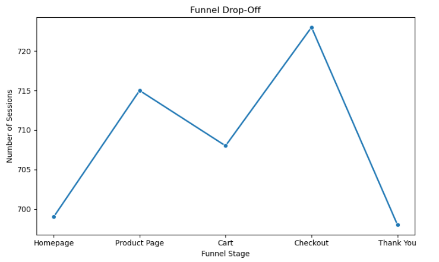

# User Behavior Analysis

## Overview
Analyzed user interaction data from a simulated e-commerce site to identify traffic patterns, engagement levels, and drop-off points in the purchase funnel. The goal is to provide actionable insights for improving the user journey and conversion rates.

## Dataset
**File:** `user_behavior_dataset.csv`  
**Columns:**  
- `user_id`, `session_id`, `page`, `time_spent_seconds`, `converted`

## Key Insights
- Homepage gets the most traffic, but major drop-offs occur at the Cart stage.  
- Product Page has the highest average engagement time.  
- Bounce rate is high, indicating many single-page visits.  

## Visuals
### 1️⃣ Most Visited Pages
  

### 2️⃣ Funnel Drop Off
  

### 3️⃣ Engagement Heatmap
  

## Tools
Python (Pandas, Matplotlib, Seaborn), Jupyter Notebook, GitHub
